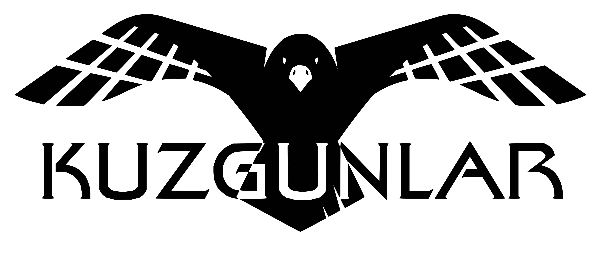

</img> 

# Kuzgunlar Chrome Tarayıcı Uzantısı

Bu uzantı son kullanıcının Kuzgunlar modelleri içerisinde bulunan Soru Cevap (Q&A) ve NER modellerini, gezindiği web sayfasında canlı olarak kullanabilmesini sağlamaktadır.

## :exclamation: Gereksinimler

 * Chrome yahut Chromium tarayıcı
 * [Kuzgunlar Web Arayüzü - Web API](https://github.com/kuzgnlar/model-web-arayuzu)

## ⚙ Kurulum

 * Öncelikle bu repoyu indirin.
 * Bilgisayarınızda Chrome'u açın.
 * Sağ üstte üç noktaya ardından Diğer araçlar'a ardından Uzantılar'ı tıklayın.
 * Sağ üstte, Geliştirici modu'nu etkinleştirin.
 * Paketlenmemiş öğe yükle'yi tıklayın.
 * İndirmiş olduğunuz repoyu seçin.
 * Bu şekilde uzantı yüklenmiş oldu. Sırada [Kuzgunlar Web API](https://github.com/kuzgnlar/model-web-interface) var.
 * Web API'yi adresinde ki yönergeleri izleyerek kendi bilgisayarınızda çalıştırın.
 
## :video_game: Kullanım

Uzantı simgesine tıklayın böylece uzantıyı kullanabilmeniz için gerekli olan ayar penceresi ekranda belirecektir.

